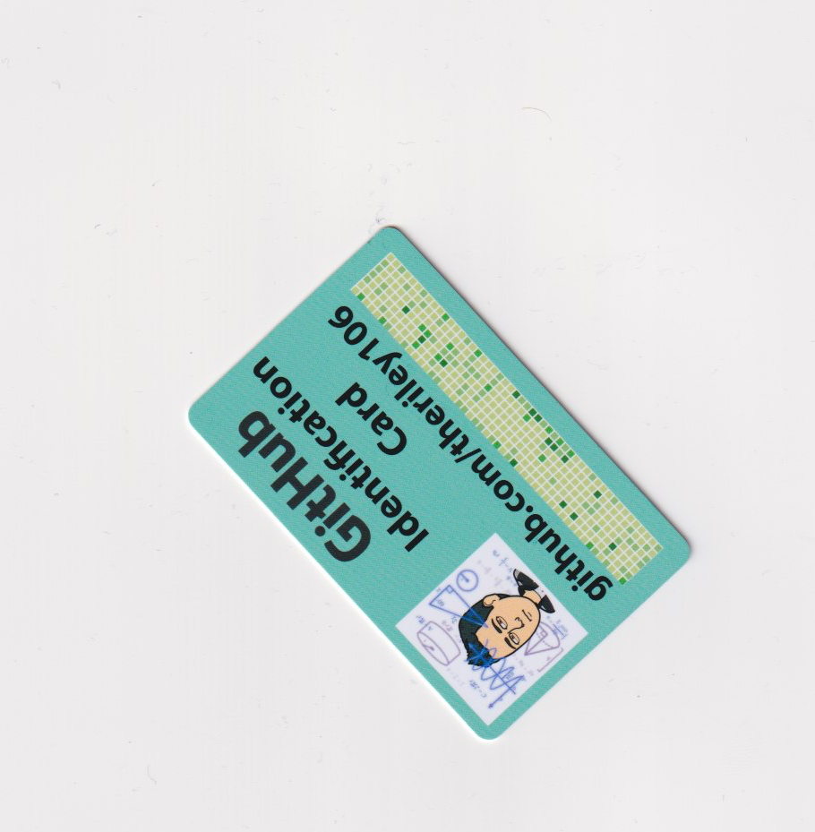

# Card_Replicator
Utility to Replicate Standard 3.375 × 2.125 inch PVC Cards using a Canon TS9120

## Process

### Step 1

A card is placed onto the scanner in any orientation.  Using scanline we can save the results from the flatbed scanner to as a JPEG.

  

### Step 2

We remove the background to make the image transparent, and apply a mask to remove noise that may be present from the scan.

  

We deskew the image to ensure the card is not slanting too far in one direction.  