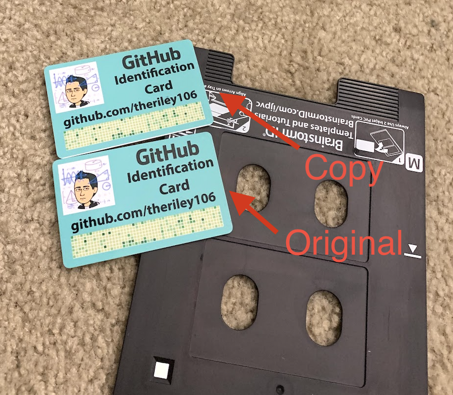
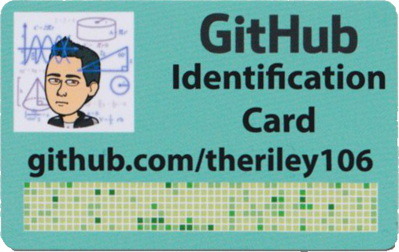
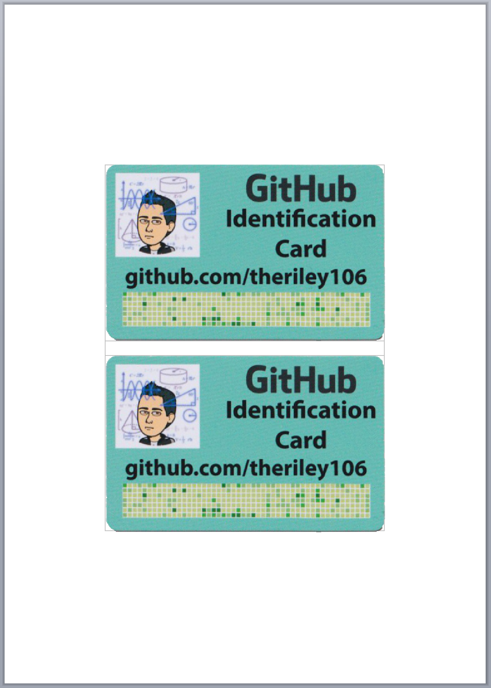

# CopyPaste
Utility to Replicate Standard 3.375 × 2.125 inch PVC Cards using a Canon TS9120

<p>
  
</p>

## Instructions

#### Install Dependancies

```bash
$ ./setup.sh

Installing dependancies...

```

#### Replicate Card

```bash
$ python main.py

Scanning started
...

Template successfully created!  Saved as: output.png
```

## Process

### Step 1

A card is placed onto the scanner in any orientation.  Using scanline we can save the results from the flatbed scanner as a JPEG.

<p>
  
</p>


### Step 2

We remove the background to make the image transparent, and apply a mask to remove noise that may be present from the scan.

<p>
  
</p>

### Step 3

We use the "Unrotate" script created by Fred Weinhaus to rotate the card.  This tool accurately fixes images where the card is rotated more than 5 degrees.

<p>
  
</p>

### Step 4

We once again apply a filter to more accurately remove the background from the image.

<p>
  
</p>

### Step 5

We deskew the image to ensure the card is not slanting too far in one direction.  Deskew generally fixes cases where the card is rotated ~5 degrees and it adds an extra level of presision when fixing unwanted slanting in the image produced by Unrotate.

<p>
  
</p>

### Step 6

Tesseract is used to do optical character recognition on the scanned image.  The image is rotated and a score is assigned based on the results from tesseract to determine the correct orientation of the card.

In this example the card is rotated 180 degrees.

<p>
  
</p>

### Step 7

A template is created to print the scanned card with a [Canon M Tray](https://brainstormidsupply.com/pvc-card-tray-for-canon-m-tray-printers-ts80xx-ts81xx-ts90xx-ts91xx.html).

<p>
  
</p>

## Acknowledgements

Huge thanks to Scott Kleper and his work on the command line scanning utility [Scanline](https://github.com/klep/scanline).  Thanks to Fred Weinhaus for his work on [Unrotate](http://www.fmwconcepts.com/imagemagick) and his various ImageMagick scripts.


